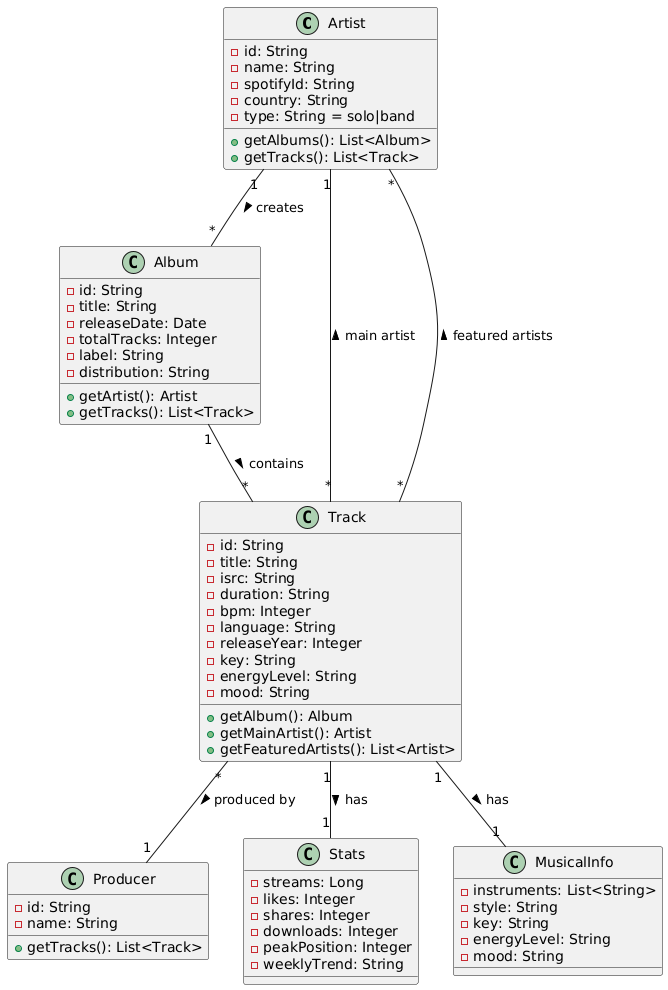

# Spécification système du serveur

## I. Introduction

Ce projet vise à développer une API REST complète en Node.js pour la gestion d'une base de données musicale.

L'objectif principal est de créer un service web documenté avec OpenAPI, permettant d'effectuer des opérations CRUD sur
différentes entités (pistes, artistes, albums, etc.). L'API est conçue pour être facilement maintenable et extensible,
offrant une interface standardisée pour les applications clientes qui souhaitent accéder et manipuler les données
musicales.

La documentation détaillée via OpenAPI assure une utilisation claire et efficace du service.

# II. Description des Entités et Relations

### 1. Description des caractéristiques vagues

- `key` = tonalité
- `label` = maison d’édition
- `energylevel` =
    - **Medium**: Groove modéré Énergie constante
    - **High**: Tempo rapide Bass puissante
    - **Dynamic**: Commence doucement Monte en puissance
- `Peak Position` =
    - Suivi des performances commerciales
    - Marketing
    - Historique du succès
- `Weekly Trend` =
    - Analyse des tendances
    - Décisions marketing
    - Programmation radio

### 2. Description des entités et relations

## Fonctionnalités principales

- Gestion des artistes
- Gestion des albums
- Gestion des pistes
- Gestion des producteurs
- Génération automatique de données

## Structure de l'API

### Points d'accès principaux

- `/artists` : Gestion des artistes
- `/albums` : Gestion des albums
- `/tracks` : Gestion des pistes
- `/producers` : Gestion des producteurs

### Méthodes disponibles

- `GET` : Récupération des données
- `POST` : Création de nouvelles entrées
- `PUT` : Mise à jour des données existantes
- `DELETE` : Suppression des données